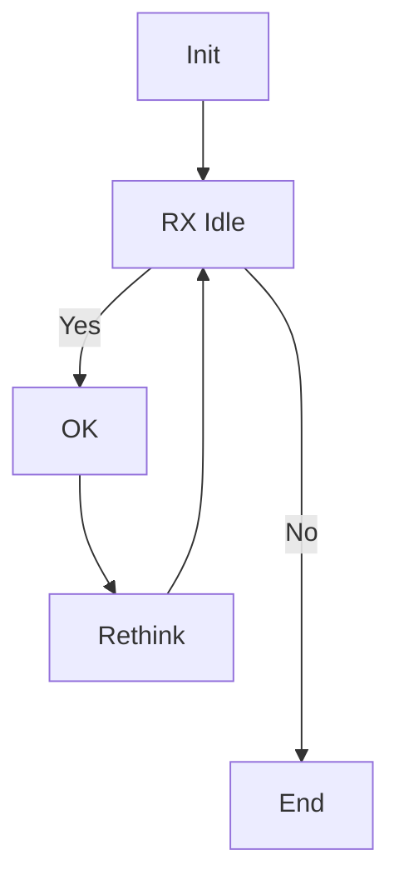

# Tinbus


## Differential Pulse
```wavedrom
{


  signal: [
  { name: "4 MHz", wave: 'P........' },
  {},
      {name: 'sig', wave: 'aaaaaaa', data: '0 0.7 1 0.7 0 -0.7 -1'},
  {name: 'D+', wave: 'z01..0..z' },
  {name: "D-", wave: 'z0..1..0z'},
  {name: "Vo", wave: 'z.u.zd.z.'}
]


}


```
# Flow Flowchart

